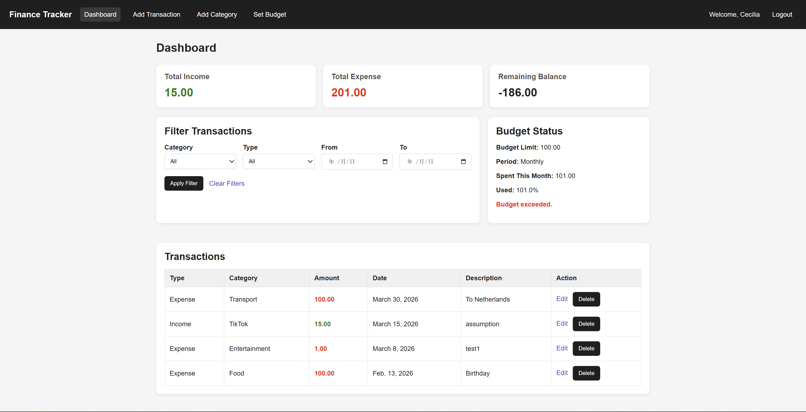

# FinanceTracker
((https://internet-technology.onrender.com)
A web-based personal finance management system built with Django.

This application allows users to track income and expenses, manage monthly budgets, and gain insights into their financial activities through an intuitive dashboard.

**Course:** COMPSCI5012 Internet Technology 2025-26  
**University:** University of Glasgow

---

## Project Overview

FinanceTracker helps users record and manage personal financial transactions.  
The system provides an overview of income, expenses, and remaining balance, while also allowing users to set monthly budgets and monitor their spending habits.

The application demonstrates the integration of backend development, database management, and interactive web interfaces using modern web technologies.

---

## Project Screenshot



## Key Features

- **User Authentication**
  - Secure registration, login, and logout
  - Each user manages their own financial data

- **Transaction Management**
  - Add, edit, and delete transactions
  - Support for both income and expense records
  - Optional descriptions for additional notes

- **Category System**
  - Transactions can be assigned to categories
  - Supports custom categories

- **Dashboard Overview**
  - Displays total income, total expenses, and remaining balance
  - Provides a quick financial summary

- **Transaction Filtering**
  - Filter transactions by category, type, and date range
  - Clear filters to reset results

- **Budget Management**
  - Set a monthly budget
  - Track spending progress
  - Display budget usage percentage
  - Alert when the budget is exceeded

---

## Tech Stack

**Backend**

- Django (Python)

**Frontend**

- HTML
- CSS
- Bootstrap
- JavaScript

**Database**

- SQLite

**Tools**

- Django ORM
- Django Template System

---

## Project Structure

```
Internet-technology/
│
├── manage.py # Django project management script
├── requirements.txt # Project dependencies
├── db.sqlite3 # SQLite database
├── README.md # Project documentation
│
├── docs/ # Project screenshots
│ └── dashboard.png
│
├── finance_project/ # Main Django project configuration
│ ├── settings.py
│ ├── urls.py
│ └── wsgi.py
│
├── tracker/ # Main application
│ ├── models.py # Database models
│ ├── views.py # Application logic
│ ├── forms.py # Django forms
│ ├── urls.py # App URL routing
│ ├── migrations/ # Database migrations
│ ├── static/ # CSS and JavaScript
│ └── templates/ # HTML templates
```

---

## Local Setup

### 1. Clone the repository

```bash
git clone https://github.com/YUSONG-gla/Internet-technology.git
cd FinanceTracker
```

### 2. Create a virtual environment

```bash
python -m venv venv
```

### 3. Activate the virtual environment

**Windows**

```bash
venv\Scripts\activate
```

**Mac / Linux**

```bash
source venv/bin/activate
```

### 4. Install dependencies

```bash
pip install -r requirements.txt
```

### 5. Apply database migrations

```bash
python manage.py migrate
```

### 6. Run the development server

```bash
python manage.py runserver
```

Open the application in your browser:

```
http://127.0.0.1:8001/
```

---

## Accessibility and Sustainability

The interface uses clear layouts and semantic HTML elements to improve readability and accessibility.  
Form inputs include validation and labels to assist users in understanding required information.

The application uses a lightweight technology stack and simple architecture to minimize resource consumption while maintaining functionality.

---

## Team Contributions

| Member          | Contribution                                                                                                     |
| --------------- | ---------------------------------------------------------------------------------------------------------------- |
| Zhili&nbsp;Zhen | Designed backend architecture, implemented authentication system and database models                             |
| Binhan&nbsp;Li  | Implemented dashboard, transaction management (add/edit/delete), filtering system, and monthly budget management |
| Yu&nbsp;Song    | Improved user interface, performed testing and debugging, and assisted with documentation                        |

---

## License

This project was developed for academic purposes.
